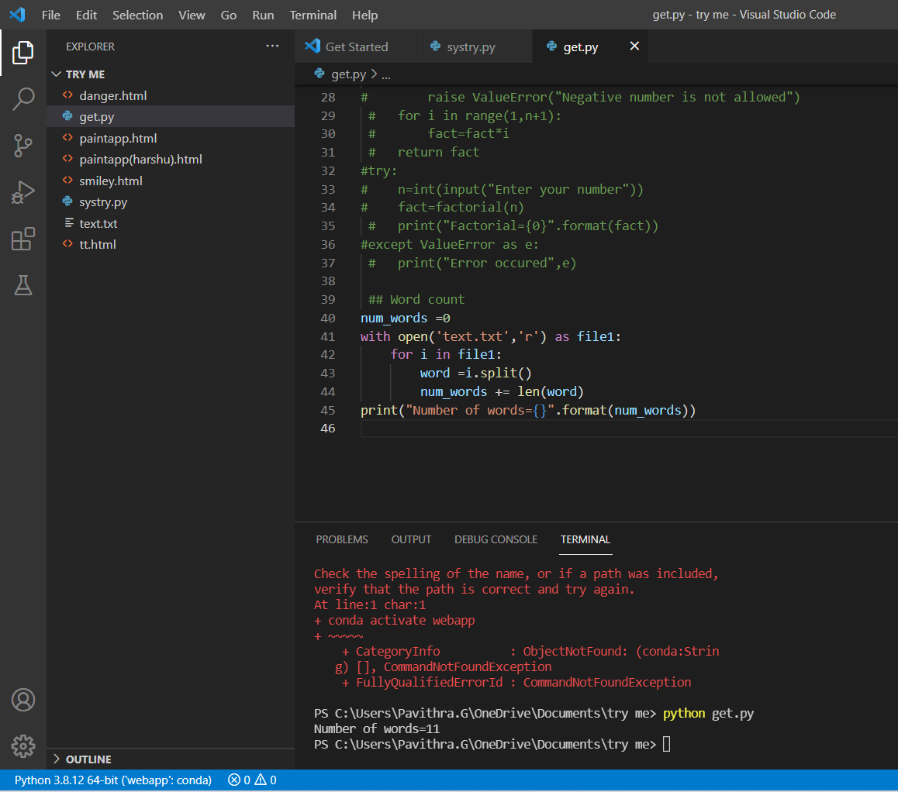

# Word-count
## AIM:
To write a python program for getting the word count from a text.
## EQUIPEMENT'S REQUIRED: 
PC
Anaconda - Python 3.7
## ALGORITHM: 
### Step 1:
Assign a variable for value zero
### Step 2: 
 open then required file by using the function "with"
### Step 3: 
Then use the for loop for assigning the i value in the file
### Step 4:  
using split function to split the words
### Step 5: 
Finding the length of the words by using len() function
### Step 6: 
Calling the function and printing the number of words.
## PROGRAM:
num_words =0
with open('text.txt','r') as file1:
    for i in file1:
        word =i.split()
        num_words += len(word)
print("Number of words={}".format(num_words))
### OUTPUT:

## RESULT:
Thus the program is written to find the word count from a text.
